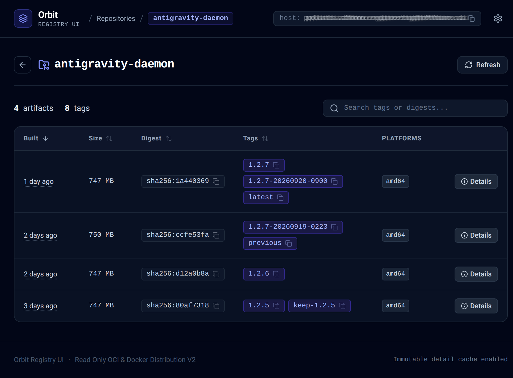

# Orbit Registry UI

Orbit is a static single-page application (SPA) behind a read-only nginx reverse proxy designed for OCI & Docker Distribution V2 registries. It displays one row per manifest digest, grouping all tags pointing to that digest as badges, listing platforms per row, showing compressed stored image sizes and build times, and providing one-click copyable `docker pull` commands.

Orbit has no backend code, no database, and no server-side state beyond a permanent, content-addressed browser cache of immutable manifest details.



## Why Digest-Centric?

Traditional registry UIs are **tag-centric**: every single tag creates a separate row in the table. In modern CI/CD pipelines where a single build is tagged with multiple references (e.g. semantic version `1.2.7`, timestamped build `1.2.7-20260920-0900`, and floating branch tag `latest`), tag-centric views create several problems:

- **Redundant Clutter**: The same underlying container image is listed multiple times as duplicate rows, rapidly drowning out actual build history.
- **Misleading Storage & Counts**: Displaying sizes and rows per tag misleads operators into seeing redundant images, obscuring what is genuinely stored on the registry.
- **Obscured Tag Relationships**: Operators cannot immediately see which tags point to the exact same artifact digest without cross-referencing hashes manually.

**Orbit is built from the ground up to be digest-centric**:

- **One Row Per Manifest Digest**: Every distinct artifact (single-arch manifest or multi-arch index) appears exactly once in the table.
- **Tags Grouped as Badges**: All tags pointing to a digest appear together on that row (`[1.2.7]`, `[1.2.7-20260920-0900]`, `[latest]`), making tag-to-digest mapping immediately obvious.
- **True Image Build Times**: Extracted directly from the image configuration blob (`created`), showing when the image was actually compiled rather than missing or ambiguous push times.
- **Accurate Stored Sizes**: Displays the compressed size of layers and config as stored in the registry, avoiding double-counting in table views.
- **First-Class Multi-Arch Visibility**: Platforms (e.g. `amd64`, `arm64/v8`) are listed directly on each row, with attestation manifests cleanly filtered out.
- **Strict Error Transparency**: Tags that fail to resolve (e.g. 404s or network drops) are tracked explicitly as failures and never silently merged into fake artifact rows.

---

## Features

- **Digest-Centric Table**: One row per manifest digest (including multi-arch OCI index / Docker manifest lists), avoiding duplicate rows for multiple tags pointing to the same artifact.
- **Accurate Size & Build Time**: Compressed image size as stored on the registry, and image build time extracted from image configuration blobs.
- **Fast Content-Addressed Detail Cache**: Manifest digests are immutable hashes; details are cached permanently in browser `localStorage` (`orbit:details:v1:*`), so subsequent loads require only tag HEAD resolution.
- **Multi-Arch & Platform Breakdown**: Lists target architectures/variants per artifact and in a detailed inspection drawer, with attestation manifests excluded.
- **Build History & Layer Inspection**: Details drawer inspects layer breakdown and image build history (marking `empty_layer` steps).
- **Tag Failure Tracking**: Unresolvable tags (e.g. 404 or network errors) are tracked as explicit failures and never merged into fake rows.
- **Copy-to-Clipboard Pull Commands**: Instant copy of `docker pull <host>/<repo>:<tag>` and `docker pull <host>/<repo>@<digest>`.
- **Read-Only Proxy & Security**: Proxies `/v2/` on the same origin while strictly enforcing `limit_except GET { deny all; }` (allowing only GET and HEAD).

---

## Runtime Contract

The container image produces an unprivileged container running on port 8080 configured entirely via environment variables:

| Parameter | Default | Description |
| --- | --- | --- |
| **Port** | `8080` | HTTP listening port |
| **User** | `101:101` | Non-root `nginx` user (compatible with read-only root filesystems) |
| **Healthcheck** | `GET /healthz` | Returns `200 "ok\n"`, no upstream call |
| `REGISTRY_UPSTREAM` | `registry:5000` | Registry `host:port` upstream for `/v2/` proxy |
| `REGISTRY_PUBLIC_URL` | `""` | Public hostname used in copied `docker pull` commands (defaults to browser host) |
| `REGISTRY_BASIC_B64` | `""` | *(Optional, Mode B only)* Base64 credentials for injected upstream authorization |

### Authentication Modes

1. **Mode A: Pass-Through (Default)**
   - The browser authenticates directly against the registry using native basic auth.
   - Nginx forwards the `Authorization` header untouched.
   - No credentials stored in the UI pod.
2. **Mode B: Injected Auth**
   - Nginx sets the `Authorization` header on all upstream requests.
   - Requires ingress-level authentication to prevent unauthorized pulls.
   - Activated by uncommenting the two lines in `nginx/default.conf.template`.

---

## Development & Testing

### Prerequisites
- Node.js 20+
- npm 9+

### Install Dependencies
```bash
npm install
```

### Run Tests
```bash
npm test
```

### Type Checking & Linting
```bash
npm run lint
```

### Build Production Assets
```bash
npm run build
```

### Run Local Dev Server
```bash
# Optionally specify a registry upstream for local testing
REGISTRY_UPSTREAM=localhost:5000 npm run dev
```

---

## Docker Build

```bash
docker build -t orbit-registry-ui:latest .
```

To run locally:
```bash
docker run -p 8080:8080 \
  -e REGISTRY_UPSTREAM=my-registry.internal:5000 \
  -e REGISTRY_PUBLIC_URL=registry.example.com \
  orbit-registry-ui:latest
```
